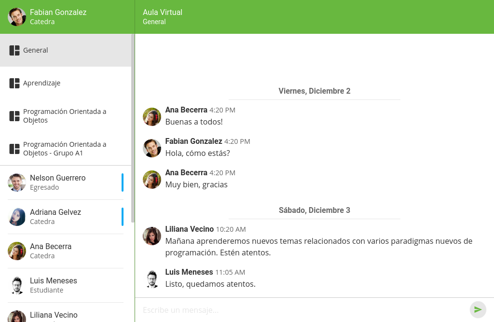
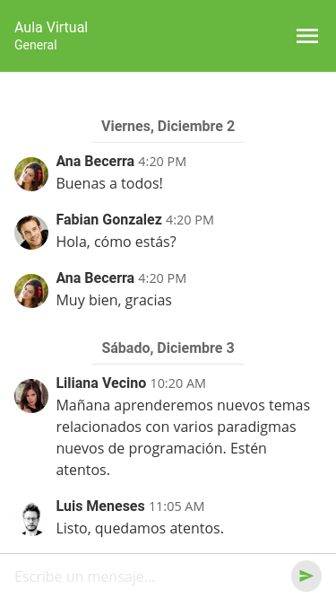
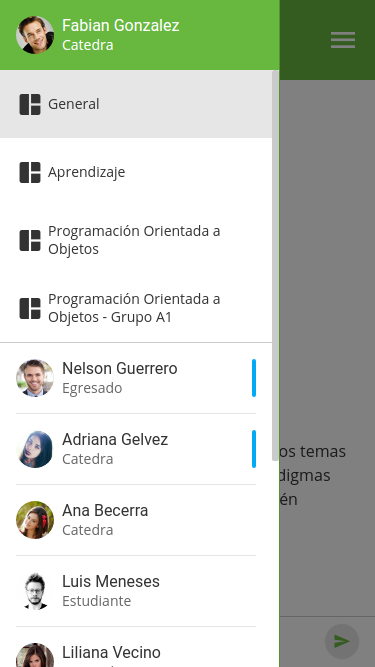

# Calumet RealTime Client

Framework client-side de comunicación en tiempo real para el proyecto COMA del Grupo Calumet.

## Licencia

[The MIT License](http://opensource.org/licenses/MIT) (MIT)

Copyright (c) 2013-2017 [Grupo Calumet](http://cormoran.uis.edu.co/calumet)
